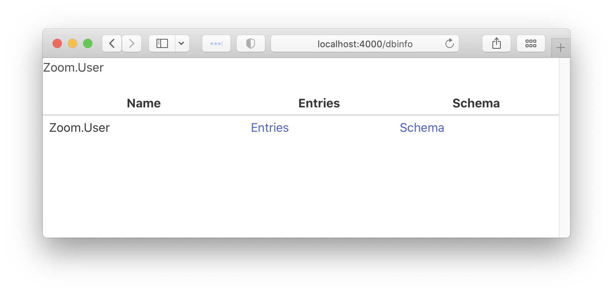

# DbInfo
<!-- MDOC !-->



# Add dashboard access for development-only usage

Once installed, update your router's configuration to forward requests to a DbInfo with a unique `name` of your choosing:

```elixir
# lib/my_app_web/router.ex
use MyAppWeb, :router
import DbInfo.Router

...

if Mix.env() == :dev do
  scope "/" do
    pipe_through :browser
    dbinfo "/dbinfo"
  end
end
```

```elixir
# config/config.exs
config :db_info, :app, :your_phoenix_app_name
```

This is all. Run `mix phx.server` and access the "/dbinfo".

# Extra: Add dashboard access on all environments (including production)

If you want to use the DbInfo in production, you should put it behind some authentication and allow only admins to access it. If your application does not have an admins-only section yet, you can use `Plug.BasicAuth` to set up some basic authentication as long as you are also using SSL (which you should anyway):

```elixir
# lib/my_app_web/router.ex
use MyAppWeb, :router
import DbInfo.Router

...

pipeline :admins_only do
  plug :admin_basic_auth
end

scope "/" do
  pipe_through [:browser, :admins_only]
  dbinfo "/dbinfo"
end

defp admin_basic_auth(conn, _opts) do
  username = System.fetch_env!("AUTH_USERNAME")
  password = System.fetch_env!("AUTH_PASSWORD")
  Plug.BasicAuth.basic_auth(conn, username: username, password: password)
end
```

# Installation

If [available in Hex](https://hex.pm/docs/publish), the package can be installed
by adding `db_info` to your list of dependencies in `mix.exs`:

```elixir
def deps do
  [
    {:db_info, "~> 0.1.0"}
  ]
end
```

# Troubleshooting

Dependency errors could be solved using following:

```elixir
def deps do
  [
    {:ecto, "~> your_version", override: :true},
    {:phoenix, "~> your_version", override: true},
    {:phoenix_html, "~> your_version", override: :true}
  ]
end
```

Documentation can be generated with [ExDoc](https://github.com/elixir-lang/ex_doc)
and published on [HexDocs](https://hexdocs.pm). Once published, the docs can
be found at [https://hexdocs.pm/db_info](https://hexdocs.pm/db_info).

